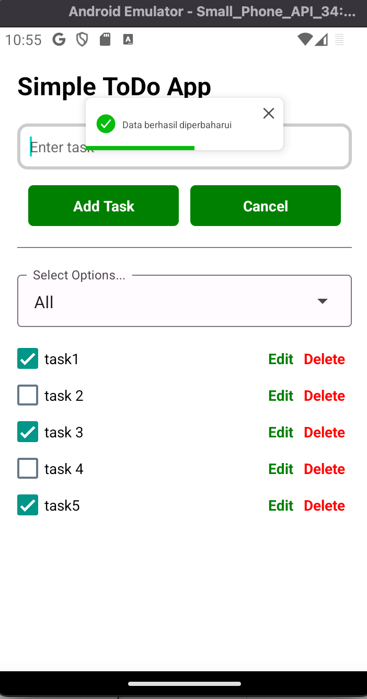

ToDo App with Expo

## Initial Setup

1. Install the package

```bash
npm install
```

2. Open android emulator manually if needed

3. Run the application

```bash
npm run android
```

or if want to open metro 

```bash
npm start
```

## Screenshots

